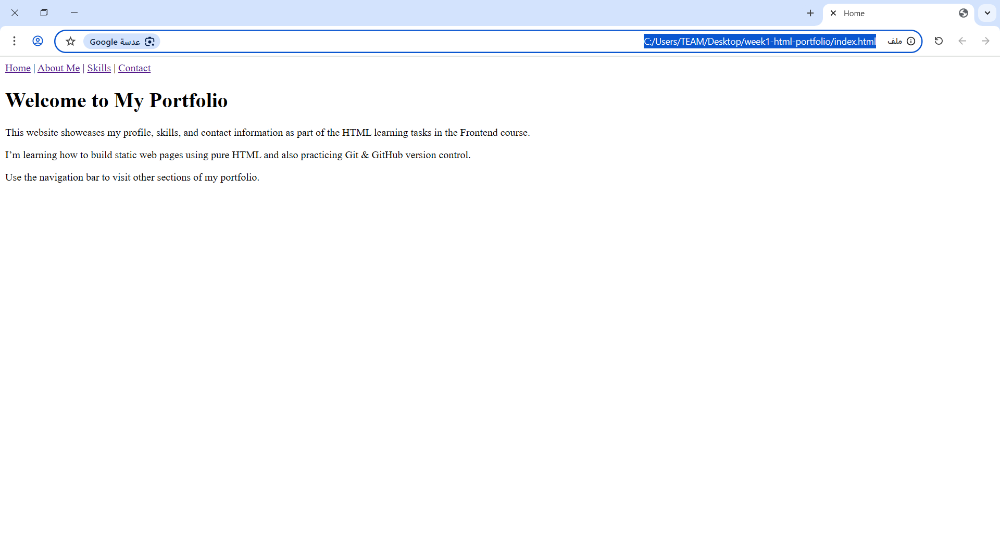

# Rana Thawabtah - Week 1 HTML Portfolio

## 🧾 Project Description:
This is a basic personal portfolio created using only HTML as part of the Frontend Student Tasks (Week 1). The site contains 4 main pages: Home, About Me, Skills, and Contact.

## 📁 Pages Included:
- **index.html**: Homepage with introduction
- **about.html**: A short description about me
- **skills.html**: List of my technical and personal skills
- **contact.html**: A basic contact form
- **profile.html**: Extra task with a table and a form

## 📸 Screenshot of Homepage:

## ✅ Tasks Completed:
- HTML structure and elements
- Navigation using `<nav>`
- Forms and tables
- Local Git repo initialized
- Pushed to GitHub

## 💡 What I Learned:
- How to structure web pages using semantic HTML
- How to create and link multiple HTML pages
- Basics of using Git and GitHub (init, add, commit, push)
