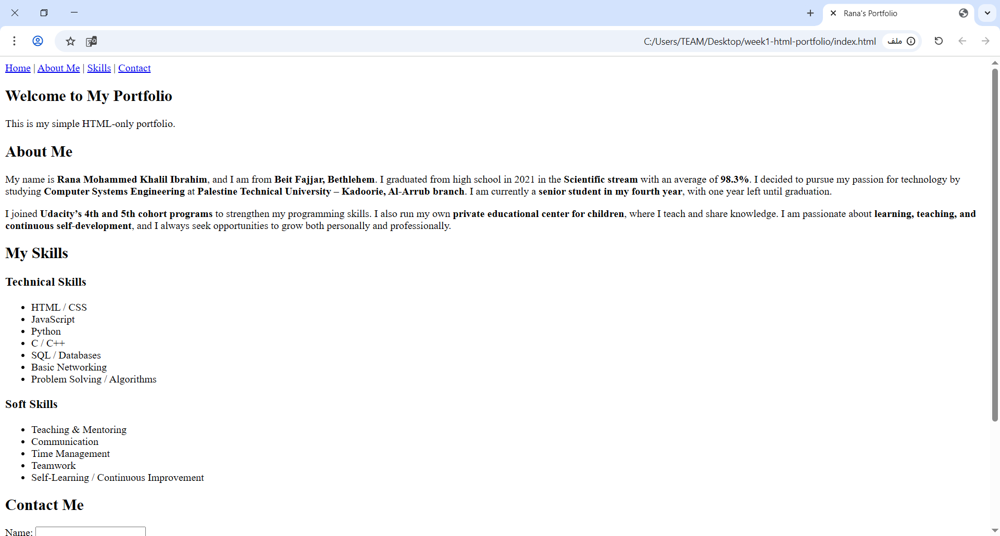

# Week 1 Tasks - HTML Portfolio

## 👤 Author
- Name: Rana Khalil Ibraheem 

## 📌 Description
This is my week 1 HTML-only portfolio project.  
It includes:
- A personal portfolio (`index.html`)
- A profile page with table and form (`profile.html`)

## 📷 Screenshot

## 📖 What I Learned
- Basics of HTML structure and semantic elements
- Creating forms with validation
- Using tables in HTML
- Initializing Git repositories and pushing to GitHub
